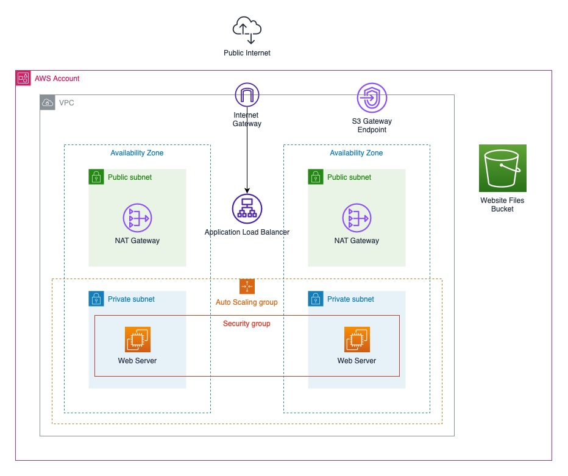

# terraform aws graduate lab 1 architecture

    

All resources should be located within the London AWS Region. This lab creates two web servers inside private subnets located in different availability zones. Traffic is routed to the servers via NAT Gateways located in the public subnets. NGWs are required in all subnets in production, however development environments should only have 1 NGW in a single subnet to reduce costs.

The web servers are launched by an autoscaling group and should be able to launch instances in all available AZs. There should be a minimum of 2 servers running, with the ability to scale up to a 3rd as needed. The instances should be Amazon Linux 2 AMIs and sized as t2.micro.

The VPC should have a CIDR range of 10.0.0.0/16, with the maximum number of IPs distributed across all subnets equally. Web traffic is managed by an Application Load Balancer, depolyed inside public subnets. The DNS name for this should be made available via terraform outputs when deployed as this is the main access URL for the site.

The load balancer should have health checks configured to allow it to manage the ASG should instances become unhealthy. For this application traffic will only be made using http however https rules should be included to allow for encrypted traffic to be added at a later date. Because traffic is managed via the loadbalancer, the security group rules for the lb can have open access on http/https ports however no other open access CIDR ranges should be used anywhere else in the application.

Inside the src directory for this lab, an index.html file is provided for the website code. This should be uploaded to an S3 bucket, which will be copied across using the provided userdata script ec2WebUserData.tftpl. The website files should be copied across to the instances via an S3 Gateway endpoint and not over the public internet. IAM Policies used should not have any wildcards on actions or resources, and only the minimum required permissions defined.

To allow cost tracking all resources should be tagged with the environment, project name and a key value pair of ‘CreatedBy: Terraform’