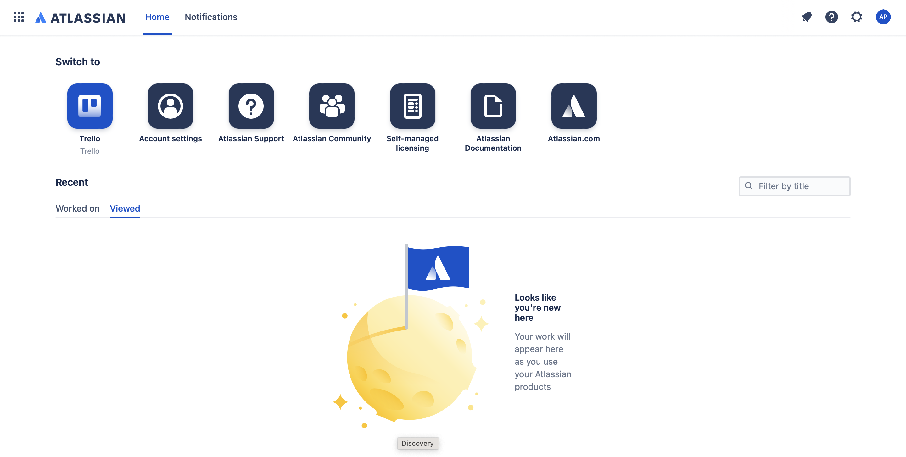
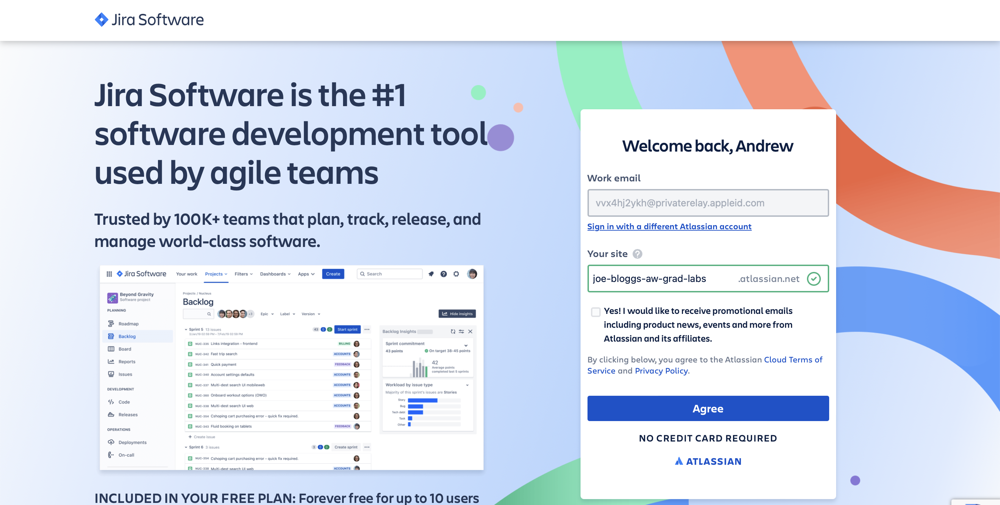
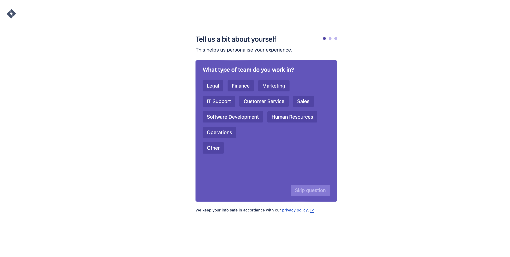
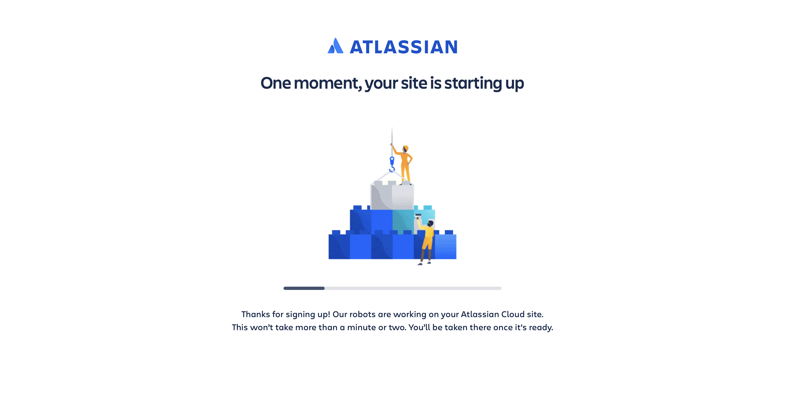
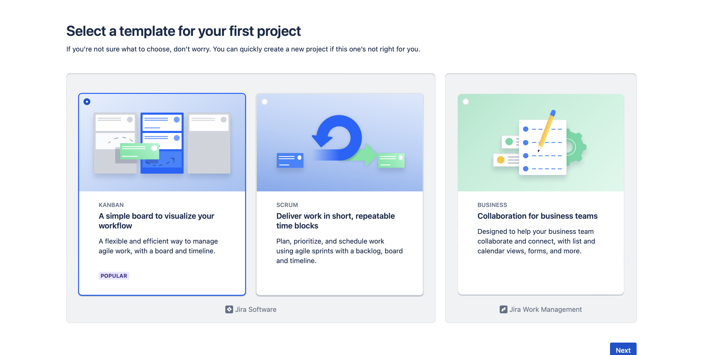
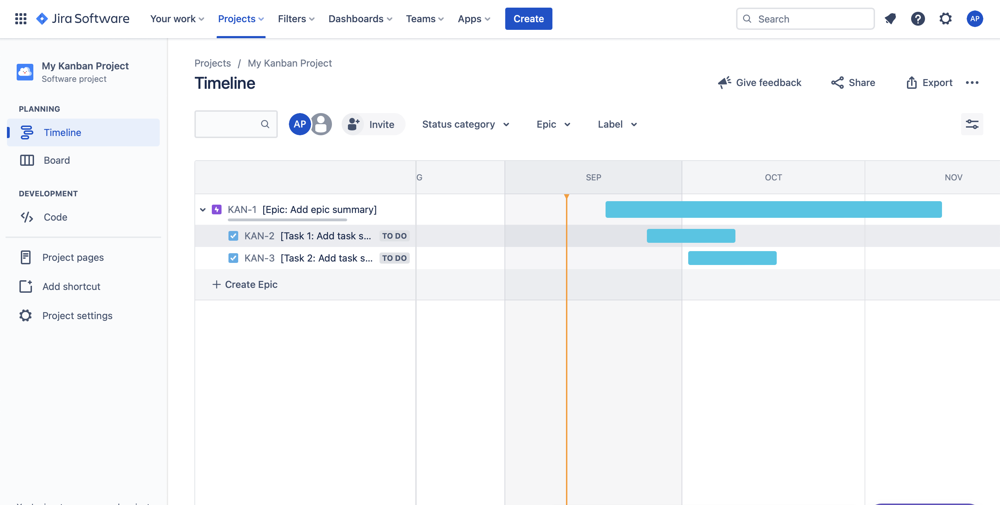
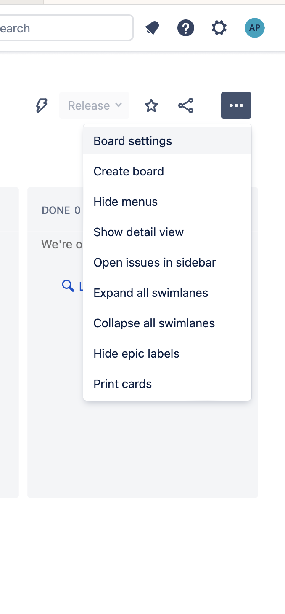
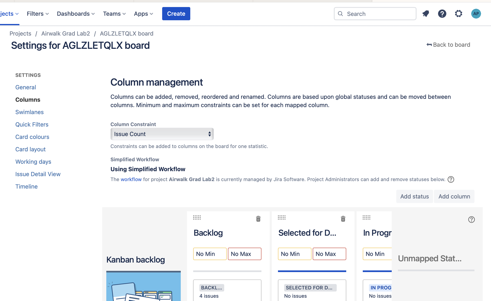
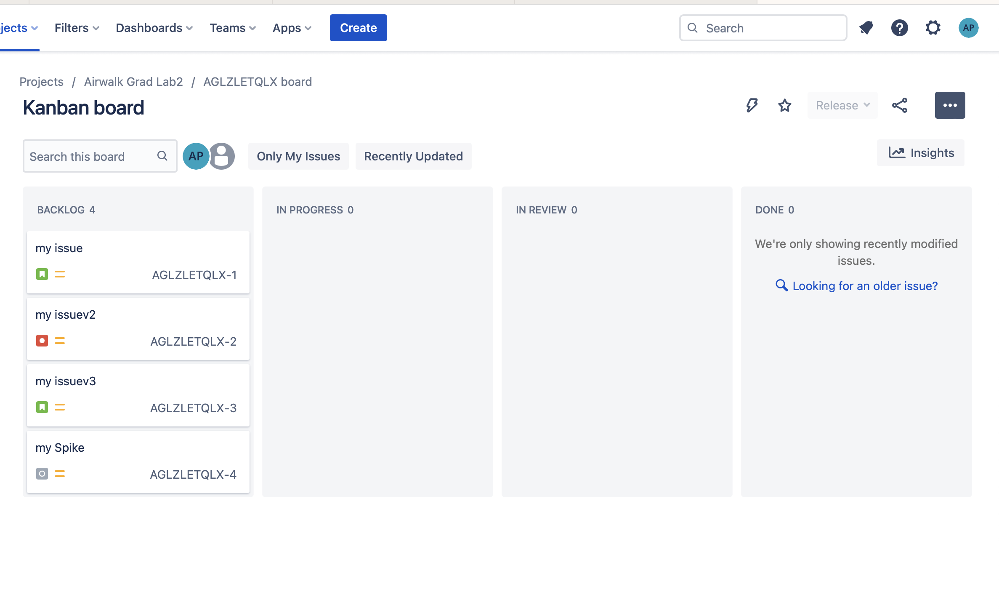

# Jira Site Setup

## Steps to create a free Jira site for use with the grad labs

1. Go to https://start.atlassian.com and sign in/create an account. The easiest way is to sign in with your appleId. You should see the below screen on successful sign in.
 
 

    
    <!-- 
Fig.1 - Successful sign in screen.
 -->

2. Go to [Jira Software](https://www.atlassian.com/software/jira?&aceid=&adposition=&adgroup=144591218076&campaign=19313277976&creative=652205474117&device=c&keyword=jira%20software&matchtype=e&network=g&placement=&ds_kids=p74602868225&ds_e=GOOGLE&ds_eid=700000001558501&ds_e1=GOOGLE&gclid=Cj0KCQjw9fqnBhDSARIsAHlcQYT_cTKYAPwAzF57iLp4dyHchEnn08gDqOpGFYI7Fy3KJtvb6NUOU28aAlr0EALw_wcB&gclsrc=aw.ds) and create a jira site called <-your-name->-aw-grad-labs. 

 

    

3. Select Skip Question on the Tell us about yourself screen until you reach the site creating screen. It should take a couple of minutes to create.

 
 

    

 

    

4. On creation you should see a screen asking to select a template and create a board. Select Kanban and click next. Once successful you should see an example board created with some tickets. Your site is now up and running!

 
 

    

 

    

5. You will need to create an API token to use with the cli. Got to https://id.atlassian.com/manage-profile/security/api-tokens and create a token. A guide for creating tokens can be found at: https://support.atlassian.com/atlassian-account/docs/manage-api-tokens-for-your-atlassian-account/

6. Once your token is created copy the API key, open the terminal and add export JIRA_TOKEN=<-your-jira-token-> to your .zshrc file. Restart the terminal and run the env command to see that the token is available in the list of environment variables.

7. Navigate to the `tickets` folder, create a python environment and activate it, then run the command `pip3 install -r requirements.txt` to install the dependencies for running the python script. Once installed, run `python3 jira.py -u <yourloginemail> -w https://<yoursiteurl>.atlassian.net --validate` to test connectivity to your site. A connectivity successful response will be displayed if everything is configured correctly

8. The Jira API doesn't currently support the ability to modify board columns. As a result some manual steps are required when a new board is created. After a new lab has been loaded and the board is displayed, click on the setting menu to the right of the screen and click board settings

 
 

    

9. Click on Columns in the left menu, and change the name of 'Selected for Development' to 'In Review'. Move the column between 'In Progress' and 'Done' to complete setup

 
 

    

10. The board should look like the below image:
 
 

    

